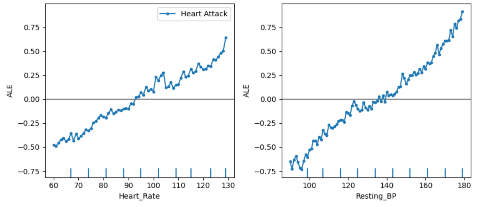

<h1> Prédiction du risque d'attaque cardiaque</h1>

<h3> Niamiti Bethel Touman et Yava Vilar Valera </h3> 

<h3> Master 2 ECAP - SVM </h3> 

## Introduction et problématique

Les maladies cardiovasculaires, et en particulier les crises cardiaques (infarctus du myocarde), sont l’une des principales causes de décès dans le monde. Malgré les progrès de la médecine et de la technologie, bon nombre de ces événements surviennent soudainement et sans diagnostic anticipé. L’un des plus grands défis aujourd’hui est d’identifier les les personnes à haut risque ainsi que les facteurs qui déterminent la probabilité de risque cardiaque. En effet, cela permet de mettre en œuvre des mesures préventives efficaces et d'adopter des habitudes de vie saines. Dans ce contexte, l’utilisation de techniques d’apprentissage automatique offre l'opportunité d'analyser de grands volumes de données et à construire des modèles prédictifs. 

## Données
Pour répondre à notre problématique, nous avons parcouru les données de Kaggle, et nous sommes basés sur une base de données qui contient des informations médicales et comportamentales liées aux facteurs de risque des maladies cardiovasculaires. Chaque ligne répresente un individu, et chaque colonne est un attribut décrivant ses caractéristiques démographiques et sanitaires, ainsi que ses habitudes de vie. Nous retrouvons en dernier la variable cible - celle qui associe chaque individu à une probabilité de crisque cardiaque (low, moderate, et high).  L'ensemble des variable sont détaillées par la suite: 

- Age (Âge) : Âge de l'individu en années.

- Gender (Sexe) : Sexe de l'individu (Masculin ou Féminin).

- Smoking (Tabagisme) : Indique si l'individu fume (Oui ou Non).

- Alcohol_Consumption (Consommation d'Alcool) : Indique si l'individu consomme de l'alcool (Oui ou Non).

- Physical_Activity_Level (Niveau d'Activité Physique) : Niveau d'activité physique de l'individu (Faible, Moyen, Élevé).

- BMI (Indice de Masse Corporelle) : Indice de masse corporelle, calculé comme le poids (en kg) divisé par la taille au carré (en m²).

- Diabetes (Diabète) : Indique si l'individu est diagnostiqué avec un diabète (Oui ou Non).

- Hypertension (Hypertension) : Indique si l'individu souffre d'hypertension artérielle (Oui ou Non).

- Cholesterol_Level (Niveau de Cholestérol) : Niveau de cholestérol dans le sang (Normal, Élevé).

- Resting_BP (Tension Artérielle au Repos) : Mesure de la tension artérielle systolique et diastolique au repos (en mmHg).

- Heart_Rate (Fréquence Cardiaque) : Fréquence cardiaque de l'individu au repos (en battements par minute).

- Family_History (Antécédents Familiaux) : Indique si l'individu a des antécédents familiaux de maladies cardiaques (Oui ou Non).

- Stress_Level (Niveau de Stress) : Niveau de stress perçu par l'individu (Faible, Moyen, Élevé).

- Chest_Pain_Type (Type de Douleur Thoracique) : Type de douleur thoracique ressentie (Stable, Instable, Liée à l'effort, Aucune).

- Thalassemia (Thalassémie) : Indique la présence d'un trouble génétique affectant les globules rouges (Normal, Mineur, Majeur).

- Fasting_Blood_Sugar (Glycémie à Jeun) : Niveau de sucre dans le sang après un jeûne de 8 heures (en mg/dL).

- ECG_Results (Résultats de l'ECG) : Résultats de l'électrocardiogramme (Normal, Anormal, Non concluant).

- Exercise_Induced_Angina (Angine Induite par l'Exercice) : Indique si l'individu souffre d'angine pendant l'exercice physique (Oui ou Non).

- Max_Heart_Rate_Achieved (Fréquence Cardiaque Maximale Atteinte) : Fréquence cardiaque maximale atteinte lors d'un effort physique (en bpm).

- Heart_Attack_Risk (Risque d'Infarctus) : Niveau de risque estimé d'une crise cardiaque (Faible, Moyen, Élevé).

## Visualisation des données

La visualisation de données a constitué une étape cruciale dans la compréhension de nos données. Cette procédure nous a permis de comprendre, dans un premier temps, que la fréquence des niveaux de risque d'infarctus sont déséquilibrés. En effet, "Low" apparaît dans le 50% des cas, tandis que "Moderate" et "High" dans le 30% et 20% des cas respectivement. 

<u>Graphique N°1 : Distribution de la probabilité de crise cardiaque </u>

Via des boxplots, nous avons vérifié qu'il n'y avait aucune valeur atypique au sein des variables quantitatives et que leur distribution est normale, sans aucune caractéristique risquée et susceptible d'être traitée ou modifiée. 

<u>Graphique N°2 : Boxplots des variables quantitatives </u>

Les diagrammes en barres des variables qualitatives ont montré que les modalités de certaines features ont la même fréquence, tandis que d'autres variables présentent un déséquilibre entre les classes. Cela est le cas, pour nommer quelques exemples, du niveau de stress, avec moins d'individus avec un stress élevé, et de la diabetes, avec également une relativement faible proportion de personnes souffrant de cette maladie. Compte tenu qu'il s'agit des variables explicatives, nous jugons ce déséquilibre ne pas engendrer un inconvénient.

<u>Graphique N°3 : Diagrammes en barres des variables qualitatives </u>

Ensuite, la matrice de corrélation a démontré un très faible lien entre les variables explicatives. Cela nous permet de toutes les inclure dans l'équation, car il n'y aura pas de problème de multicolinéarité et tous les régresseurs ont le potentiel d'apporter une information différente et unique. Nous avons en plus mené une analyse bivariée des variables explicatives selon la probabilité de crise cardiaque, qui conduit effectivement à distinguer la fréquence des niveaux des probabilités selon les différentes modalités des régresseurs.

Enfin, nous nous sommes assurés de savoir qu'il n'y a pas de doublons ni de valeurs manquantes dans la base de données. 

# Partie 1: Premières modélisations 

## Traitement des données  

Avant de démarrer la modélisation, nous nous sommes assurés de nettoyer et préparer la base de données. Ayant compris qu'aucun attribut comportait des valeurs atypiques et qu'il n'y avait pas de valeurs manquantes ni de problème de corrélation, nous nous sommes focalisés davantage sur le codage et format des variables, la normalisation et le re-échantillonage. A préciser que, ayant en tête que différentes procédures peuvent toutes être également correctes et qu'il est souvent difficile de connaître à priori quel est le traitement idéal des données pour aboutir au meilleur modèle possible, nous avons décidé de tester différentes approches. En particulier, nous avons commencé par le traitement qui nous semblait de base le plus adéquat en accord avec la théorie, pour ensuite apporter des modifications ayant l'objectif d'améliorer la performance des modèles. Ces dernières modifications seront présentées plus tard dans l'analyse, tandis que les section ci-dessous présentent le traitement initial. 

### Justification du codage des variables

La variable cible - Risque d'Infarctus - étant qualitative ordinale, nous avons décidé de la coder telle quelle à l'aide de la fonction ordinalEncoder. Ainsi, nous avons transformé les modalités en nombre suivant un ordre de 0 à 2.

Parmi les variables explicatives, nous comportons tant de variables quantitatives, que qualitatives ordinales et nominales. Tandis que les quantitatives n'ont pas nécessité de transformation, nous avons codé les qualitatives ordinales (Physical_Activity_Level et Stress_Level) de la même manière que la variable d'intérêt avec ordinalEncoder. Les attributs qualitatifs restants (nominaux) ont été transformés en variables binaires avec la fonction get_dummies, de manière à ce que chaque modalité représente una variable additionnelle, à l'exeception de la modalité de référence. 

### Justification du re-échantillonage 

Comme introduit, la variable dépendante comporte des modalités qui sont déséquilibrées en termes de la fréquence de chaque modalité. Même si ce déséquilibre n'est pas extrême, il convient de re-échantilloner cette variable afin d'éviter que les modèles apprenent de la classe la plus fréquente en détriment des autres. Ainsi, nous avons utilisé la méthode de suréchantillonnage avec remplacement (bootstrapping), qui a été appliquée car elle permet de maintenir la distribution originale des classes en répliquant des instances réelles, évitant ainsi la création de données synthétiques qui pourraient induire un surajustement.

### Justification de la normalisation

Nous comportons un ensemble de variables quantitatives qui présentent des échelles différentes, s'étandant au sein d'intervals de valeurs différents. Par conséquent, après avoir coupé le jeu de données en un jeu d'entraînement (70%) et un jeu de test (30%), nous avons décidé de normaliser ces variables avec l'approche Min-Max Scaling, de façon à ce que toutes les valeurs soient comprises de 0 à 1 et soient directement comparables. Dans un premier temps, nous avons privilégié cette approche face à la standarization parce que les features n'ont pas de valeurs atypiques et donc la normalisation est robuste dans notre cas. 

## Modèles

### Modèles MultiClass

Nous avons démarré notre modélisation avec les modèles de Support Vecteur Machine en prenant en compte les trois classes (Low, Moderate, et High). Nous avons trouvé convénient de comparer l'approche linéaire avec l'approche non linéaire, et, dans ce dernier cas, d'utiliser tant un kernel polynomique que RBF (Radial Basis Function). En effet, il peut être difficile d'anticiper si les données sont ou non séparables linéairement par une ligne. Dans le cadre de la classification multiclasse, nous avons également employé les deux stratégies suivantes: la forme de fonction de décision OVO (One-Versus-One), et la forme de fonction de décision OVR (One-Versus-Rest). Toutes ces combinations possibles nous ont fournis un total de 6 modèles. 

Ensuite, nous avons également testé una variété de modélisations additionnelles. Il s'agit d'un SVM linéaire classique (sans la fonction kernel), qui peut être adapté à nos données en raison de leur grande voluminosité; d'une régression logistique, d'un random forest, et d'un SDG classifier. 

A préciser que tous les modèles initiales sont executés avec les paramètres par défaut - et les plus précis seront tunés par la suite. 

Un premier constat est remarquable lorsqu'on compare les Support Vecteur Machine avec les trois fonctions de kernel différentes (linéaire, poly, et rfb) : Les modèles linéaires ne génèrent pas (ou quasiment pas) de surapprentissage, alors que les non-linaires, oui. Cela est observé lorsqu'on compare la précision de la prédiction sur le jeu de test et d'entraînement - la précision sur le jeu d'entraînement étant largement au-dessus de celle sur les données de test chez les modèles non linéaires. Malgré cela, la précision ainsi que le f1-score sur le jeu de test reste légèrement supérieure lorsqu'on modélise les modèles non-linéaires. Ce constat représente une première piste sur le type de relation qui mieux définit les variables. 

Les quatres modélisations restantes (SVM linéaire sans kernel, régression logistique, SDG Classifier, et Ranfom Forest) ont produit des précisions de prédictions similaires. En particulier, le SVM linéaire et la régression logistique fournissent des résultats identiques, avec un f1-score de 0,31 sur le jeu de test et un léger surapprentissage. 
Le SDG ne surpasse le F1-score de ces deux derniers modèles que d'un point (0,32). La forêt aléatoire produit des prédictions plus satisfaisantes, avec un f1-score de 0,37. De plus, il arrive à mieux prédire les trois classes. Autrement dit, la précision et le f1-score sont similaires parmis les trois modalités existantes comparé aux modèles précédents. Cependant, la forêt aléatoire a une prédiction parfaite sur le jeu d'entrâinement, de 1 point, tandis qu'il descend à 0,37 sur le jeu de test, indiquant qu'il a des difficultés à s'adapter à de nouvelles données. 

<u>Tableau N°1 :  Evaluation des modèles avec trois classes </u>

| Modèle            | Accuracy Train | Accuracy Test |  F1 Test |
|-----------------------:|-----------------:|------------------:|-----------------:|
|SVM Kernel Linéaire OVO |              0,38 |               0,34 |              0,33 |      
|SVM Kernel Linéaire OVR |              0,34 |               0,32 |              0,32 |       
|SVM Kernel Poly OVO     |              0,64 |               0,35 |              0,35 |       
|SVM Kernel Poly OVR     |              0,70 |               0,37 |              0,37 |  
|SVM Kernel RBF OVO      |              0,58 |               0,34 |              0,33 | 
|SVM Kernel RBF OVR      |              0,81 |               0,36 |              0,36 | 
|SVM linéaire classique  |              0,38 |               0,32 |              0,31 | 
|Régression Logistique   |              0,38 |               0,32 |              0,31 |     
|SGD Classifier          |              0,36 |               0,34 |              0,32 |  
|Random Forest           |              1,00 |               0,38 |              0,38 |  

Par ailleurs, l'évaluation de tous les modèles discutés jusqu'à présent nous révèle qu'ils ne sont pas très performants. Le f1-score et la précision n'atteintent pas le 40% dans aucun cas sur le jeu de test. Cele signifie qu'aucun d'entre eux arrive à bien prédire la probabilité d'attaque cardiaque dans plus de 60% des cas. Par conséquent, il est judicieux, selon notre point de vue, de réduire le nombre de modalités à deux (Low et High) et de comparer les performances. 

### Modèles avec deux Modalités

Dans cette partie, nous avons relancé les mêmes modèles: SVM linéaire, linéaire avec kernel, non-linéaire polynomique et rbf, SDG classifier, régression logistique, et ranfom forest, mais en prenant en compte seuelment les classes "High", et "Low". Les résultats ont démontré que le random forest est le plus performant avec un f1-score de 0,54 sur le jeu de test. Cependant, à nouveau, ce score est de 1 sur le jeu d'entraînement. Les modèles non linéaires sont également moyennement performants avec un f1-score (jeu de test) d'environ 0,51 et un équilibre de prédiction entre les classes. Mais de manière similaire au random forest, même si de manière pas si prononcée et extrême, les modèles sont bien meilleurs sur les jeux d'entraînement. Un équilibre entre entrâinement et test implique diminuer la précision dans les données de test, comme il arrive avec les modèles linéaires et le SDG. Ceux qui présentent les faibles scores en termes de précision et de f1 sont le SVM linéaire avec kernel et le SGD, avec un f1 d'environ 0,45. De plus, ces modèles ne prédient pas beaucoup la classe "high", avec des f1 de peu plus de 0,30 pur cette classe comparé à plus de 0,50 pour la classe "low". 

Ce qui est constaté est qu'ont a réussi à améliorer la qualité prédictive de tous les modèles en réduisant le nombre de modalités de la variable cible. Cependant, en même temps, cela met des lacunes si notre objectif principal est de séparer entre les trois classes. 

<u>Tableau N°2 :  Evaluation des modèles avec deux classes (Low et High) </u>

| Modèle            | Accuracy Train | Accuracy Test | F1 Test |
|-----------------------:|-----------------:|------------------:|-----------------:|
|SVM Kernel Linéaire     |              O,52 |               0,48 |              0,44 |       
|SVM Kernel Poly         |              0,77 |              0,56 |              0,56 |     
|SVM Kernel RBF          |              0,71 |              0,51 |              0,51 |      
|SVM linéaire classique  |              O,55 |              0,49 |              0,49 |      
|Régression Logistique   |              0,55 |               0,49 |              0,44 |       
|SGD Classifier          |              0,51 |               0,48 |              0,45 |     
|Random Forest           |              1,0 |               0,42 |              0,54 |     

## Cross-validation des modèles

Nous nous sommes ensuite intéressées à réaliser une cross-validation des modèles afin d'évaluer les performances d'un modèle de manière plus fiable et robuste. Nous appliquons cette technique uniquement sur les modèles à deux modalités car ils se sont avérés être plus de meilleur qualité dans l'ensemble. La cross-validation nous aidera à choisir les trois meilleurs parmi un ensemble de modèles qui sont eux déjà supérieurs à autres. Les résultats de la cross-validation avec 5 folds sont disponibles sur le graphique N°3. 

<u>Graphique N°3 :Evolution de l'accuracy en fonction des folds </u>

Comme indique le tableau 3, le meilleur modèle en termes de précision est le Random Forest, alors qu'en termes de dispersion, c'est le modèle SVC linéaire. Les modèles SVM non linéaires, avec noyeau poly et rbf, précèdent le Random Forest en termes de précision. Il s'agit donc des trois meilleurs modèles qui seront tunés par la suite.

<u>Tableau N°3 :  Cross-validation des modèles avec deux classes (Low et High) </u>

| Modèle            | Score Moyen | Ecart-type |
|-----------------------:|-----------------:|------------------:|
|SVM Kernel Linéaire     |              O,50 |               0,019 |                    
|SVM Kernel Poly         |              0,53 |              0,03 |                   
|SVM Kernel RBF          |              0,53 |              0,03 |                 
|SVM linéaire classique  |              O,50 |              0,016 |                   
|Régression Logistique   |              0,50 |               0,49 |                   
|SGD Classifier          |              0,51 |               0,009 |                 
|Random Forest           |              0,55 |               0,03 |              

## Optimisation des modèles

### Modèles non linéaires

Les modèles non linéaires ont été tunés avec la fonction Grid Search. Nous avons cherché à comprendre si le noyeau poly ou rbf est plus performant lorsqu'on les modélise également avec des paramètres additionnels dans les équations, notamment avec différentes valeurs de gamma (rbf), degree (poly) et C. Les résultats ont demontré que la meilleur combinaison d'estimateur est 'C': 1, 'gamma': 2, 'kernel': 'rbf' pour un score de: 0.562 et un écart-type de 0.015. Ayant testé ces paramètres sur le jeu d'entraînement, nous avons remarqué que l'accuracy est de 1.0. Cependant, lorsqu'on le teste sur de nouvelles données, l'accuracy descend à 0,55. Cette situation de surapprentissage nous a enmené à chercher des alternatives visant à réduire cet inconvénient. La solution est passée par réduire les valeurs de gamma et de C significativement. Avec une valeur de 0,1 pour ces deux paramètres, on réussit à supprimer le surapprentissage, avec un training score: 0.51 et un test score: 0.47, ce qui reste acceptable. Cependant, la classe "High" reste quasiment pas prédite, avec seuelement 4 des cas qui ont été classés correctement pour cette modalité. Cette situation n'est pas idéale car on n'arrive pas à prédire la probabilité élevée de risque d'infartus qui est pour autant importante. 

<u>Graphique N°4 :Matrice de confusion modèle SVC noyeau RBF - surajusté </u>

<u>Graphique N°5 : Matrice de confusion modèle SVC noyeau RBF - non surajusté </u>

<u>Tableau N°5 :  Comparison des modèles SVC noyeau RBF avec différents paramètres </u>

| Kernel            | C | gamma | Accuracy Test | Accuracy Train |
|-----------------------:|-----------------:|------------------:|------------------:|------------------:|
| RBF     |              1  |               2   |         1     |              0,55 |                 
|RBF      |              0,1 |              0,1 |         O,51 |              0,47 |                

### Modèle forêt aléatoire

Le modèle de la forêt aléatoire a été optimisé avec la fonction Random Search en définissant un ensemble de paramètres variés. Le résultat le plus optimal s'est avéré être le suivant: 'n_estimators': 500, 'min_samples_split': 5, 'min_samples_leaf': 8, 'max_features': 'sqrt', 'max_depth': 30, 'criterion': 'log_loss'. Cependant, à nouveau, en évaluant le MSE, on s'est rendu compte qu'il y a un grand surapprentissage car l'accuracy sur le jeu d'entraînement est beaucoup plus grand que celui de test. Nous avons réussi à résoudre cela principalement en réduisant le nombre d'arbres. Les paramètres ont passé à être les suivants: n_estimators=50, random_state=42, max_depth=1, min_samples_split=10, min_samples_leaf=10, max_features='sqrt', criterion="log_loss. Nous nous sommes rendus compte que le paramètre qui joue vraiment est le nombre d'estimateurs, et augmenter ou réduire les autres paramètres n'impactait pas les résultats. Toutefois, cela a impliqué renoncer à une prédiction équilibrée entre les classes, car, comme il arrive avec les modèles non linéaires, seuelement 13 cas de probabilité de risque élevée ont été classés correctement. Le tableau N°6 ainsi que les graphiques N° 6 et 7 synthéthisent les résultats obtenus via des matrices de confusion et un tableau avec les principaux résultats. 

<u> Graphique N°6 : Matrice de confusion modèle Random Forest - surajusté </u>

<u>Graphique N°7 : Matrice de confusion modèle Random Forest - non surajusté </u>

<u>Tableau N°6 :  Comparison des modèles Ranfom Forest avec différents paramètres </u>

| Modèle           | Number_estimators | Max_depth        | Min_samples_split | Min_samples_leaf  | Max_features | Criterion | Accuracy Train | Accuracy Test |
|-----------------:|-----------------:|------------------:|------------------:|------------------:| -------------:| ---------:| -------------:| -------------
|Random Forest     |        500       |                 30|         5         |              8    |   'sqrt'      | 'log_loss'|      0,96     |     0,57      |
|Random Forest     |               50 |               1   |         10        |             10    |   'sqrt'      | 'log_loss'|      0,48     |     0,51      |  

# Partie 2: Deuxièmes modélisations

## Traitement des données

Ayant l'ambition d'améliorer la capacité prédictive des modèles, dans cette partie, nous décidons de re-traiter les données afin de comprendre si cela impacte les résultats. Nous nous concentrons uniquement sur une problématique de classification binaire avec les classes extrêmes High et Low (qui s'est déjà relevé être plus efficace). 
Trois changements majeurs ont été appliqués en ce qui concerne la préparation des données: 

- Nous encodons toutes les variables qualitatives avec la fonction labelEncoder de manière à ce que chaque modalité prenne une valeur différente ordonée au lieu de créer des variables binaires

- Nous ne re-échantillonons pas la variable cible avec la méthode de suréchantillonnage avec remplacement (bootstrapping). En effet, il peut être intéressant de savoir comment les modèles se comportent sous une situation de déséquilibre modérée.

- L'âge n'a pas été standarisé afin de faciliter l'interprétation de l'impact de cette variable.

### Sélection de feature

Nous avons décidé d'inclure une approche intéressante: effectuer une sélection de variables, ce qui offre l'avantage de réduire la complexité du modèle et de diminuer le risque de surapprentissage en éliminant les informations non pertinentes. Pour cela, nous avons utilisé la fonction SelectKBest afin de retenir les sept meilleures variables jugées pertinentes.

Après cette procédure, nous retenons des variables telles que le genre, la consommation d'alcool, le niveau d'activité physique, l'hypertension artérielle, la pression artérielle au repos, les troubles génétiques affectant les globules rouges, ainsi que la fréquence cardiaque.

### Modélisation et optimisation avec les variables sélectionnées

Ces variables explicatives sélectionnées nous ont permis de lancer un premier modèle RandomForest, qui réalise d'excellentes performances sur le jeu d'entraînement avec un F1-score de 98 %. Cependant, nous constatons un surapprentissage, car ce modèle n’enregistre que 60 % de F1-score sur le jeu de test, pour 64 % de précision.

Une seconde modélisation est effectuée avec les deux modalités, en utilisant un XGB Classifier, qui réalise des prédictions juste au-dessus de la moyenne, avec un F1-score inférieur à 70 % sur le jeu d'entraînement, pour une précision de 69 % sur le jeu de test et un F1-score de 60 %.

A préciser que le Random Forest a été choisi car nous avons déjà constaté sa supériorité dans la partie précédente, et le XGBooost, de par sa similarité au Random Forest, a le potentiel de contributer positivement à notre analyse.

Nous avons procédé ensuite à un tuning des hyperparamètres du modèle XGB Classifier, jugé plus performant face au Random Forest. Le tunage de ce modèle n'a pas amélioré significativement les résultats, mais a augmenté le F1-score de 1 point, à 61%, tandis qu'il n'a pas aggravé les métriques d'évaluation restantes. On observe qu'il s'agit du modèle avec les scores les plus élevés jusqu'à présent, et par conséquent, on le définit comme le modèle final choisi. 

## Comparaison du modèle retenu avec un modèle de référence

### Modèle de référence : LogisticRegression

Nous avons décidé de présenter et interpréter un modèle de référence, notament une regression logistique, qui servira de benchmark au modèle XGBoost. 

- Classification Report (Test)

| Classe         | Précision | Rappel | F1-score | Support | 
|----------------|-----------|--------|----------|---------|
| 0              | 0.71      | 0.51   | 0.60     | 7507    |
| 1              | 0.29      | 0.49   | 0.36     | 3022    |
|                |           |        |          |         |
| **Accuracy**   |           |        | 0.51     | 10529   |
| **Macro avg**  | 0.50      | 0.50   | 0.48     | 10529   |
| **Weighted avg** | 0.59    | 0.51   | 0.53     | 10529   |

- Matrice de confusion (Test)

|              | Prédit : 0 | Prédit : 1 |
|--------------|------------|------------|
| Réel : 0     | 3850       | 3657       |
| Réel : 1     | 1542       | 1480       |

- Métriques globales (Test)

| Métrique              | Valeur  |
|-----------------------|---------|
| Accuracy              | 0.5062  |
| F1-score pondéré      | 0.5297  |

- Matrice de confusion (Train)

|              | Prédit : 0 | Prédit : 1 |
|--------------|------------|------------|
| Réel : 0     | 8938       | 8579       |
| Réel : 1     | 3414       | 3636       |

- Métriques globales (Train)

| Métrique              | Valeur  |
|-----------------------|---------|
| Accuracy              | 0.5118  |
| F1-score pondéré      | 0.5351  |

Ce modèle permet d'obtenir une précision globale de 51 %, avec une précision pour la classe Low supérieure à 70 %, contre moins de 30 % pour la classe High, ce qui implique que le modèle de régression logistique de base permet de mieux classer les cas de faible probabilité d'attaque cardiaque que ceux de probabilité élevée.
Cette différence pourrait être due à un déséquilibre entre les deux classes, car on observe près de deux fois plus d'observations dans la classe Low que dans la classe High.

Outre la précision assez moyenne de ce modèle, on relève une valeur de la métrique F1-score légèrement plus élevée. En effet, bien que la classe minoritaire présente une faible précision, elle affiche un rappel plus élevé, indiquant que le modèle parvient à identifier 49 % des cas de la modalité High, bien qu'il se trompe dans 70 % des cas sur cette modalité. Cela montre que le modèle n’est pas en situation de surapprentissage.

Une réprésentation de l'impact des variables dans le modèle de régression logistique est présenté sur ce graphique.

<u>Graphique N°7 : Coefficients de la Régression Logistique </u>

Le graphique permet de constater que le fait de ne pas avoir de l'hypertension, de faire une activité physique ainsi que d'être une femme diminue le risque d'avoir une forte probabilité d'attaque cardiaque (classe de référence Female : 0).
Cependant, le fait de consommer de l'alcool, d'avoir un trouble génétique et d'avoir une haute fréquence cardiaque augmente le risque de faire une attaque cardiaque de manière considérable. 

Nous chargeons ensuite le meilleur modèle.

### Modèle retenu: XGBoost 

- Rapport de classification (Test)

| Classe         | Précision | Rappel | F1-score | Support |
|----------------|-----------|--------|----------|---------|
| 0              | 0.71      | 0.91   | 0.80     | 7507    |
| 1              | 0.30      | 0.10   | 0.15     | 3022    |
|                |           |        |          |         |
| **Accuracy**   |           |        | 0.68     | 10529   |
| **Macro avg**  | 0.51      | 0.50   | 0.47     | 10529   |
| **Weighted avg** | 0.59    | 0.68   | 0.61     | 10529   |

- Matrice de confusion (Test)

|              | Prédit : 0 | Prédit : 1 |
|--------------|------------|------------|
| Réel : 0     | 6821       | 686        |
| Réel : 1     | 2731       | 291        |

- Métriques globales

| Métrique              | Valeur  |
|-----------------------|---------|
| Accuracy              | 0.6755  |
| F1-score pondéré      | 0.6119  |

- Matrice de confusion (Train)

|              | Prédit : 0 | Prédit : 1 |
|--------------|------------|------------|
| Réel : 0     | 17215      | 302        |
| Réel : 1     | 4479       | 2571       |

- Métriques globales (Train)

| Métrique              | Valeur  |
|-----------------------|---------|
| Accuracy              | 0.8054  |
| F1-score pondéré      | 0.7748  |

Comme déjà indiqué, le meilleure modèle de notre projet se distingue des autres avec une précision globale de 67% avec un f1 pondéré de 61%. Nous constatons néanmoins que celui possède une meilleure capacité prédictive pour la classe **Low** avec une précision de 71% et une sensibilité de 91%. Après la présentation du meilleur modèle, nous passons à l'interprétabilité de ce modèle.

# Partie 3: Explicabilité et interprétabilité 

## PDP : Partial Dependance Plot 

### Deux features

Nous démarrons l'interpréabilité du modèle avec le graphique de dépendance partielle (PDP), qui montre la relation entre une ou plusieurs caractéristiques et la prédiction moyenne du modèle, tout en maintenant toutes les autres variables fixes. Nous sélectionnons les deux variables quantitatives de l'étude. 

<u>Graphique N°8 : Partial Dependence Plot </u>

Ce graphique montre d'importantes fluctuations.Heart_Rate influence positivement la prédiction des classes du modèle, notamment autour de 105 bpm. En revanche, Resting_BP affiche un effet instable et difficile à interpréter, ce qui laisse penser que Heart_Rate est une variable plus prédictive. Ces variations marquées indiquent également la possible présence d’interactions complexes avec d’autres variables.

### Fetaures combinés

<u>Graphique N°9 : Partial Dependence Plot des features commbinées </u>

Le graphique PDP combiné pour les variables Heart_Rate et Resting_BP met en lumière des interactions complexes entre ces deux facteurs dans les prédictions du modèle XGBoost. On remarque que Heart_Rate semble avoir un effet plus stable, notamment autour de 100 bpm, où l’influence sur la prédiction devient plus marquée. En revanche, Resting_BP présente des variations moins régulières et plus difficiles à interpréter, ce qui peut indiquer qu’il interagit avec d'autres variables ou que son impact dépend de contextes spécifiques dans les données.

Certaines zones du graphique montrent clairement des combinaisons particulières de ces deux variables qui modifient fortement la sortie du modèle. Cela souligne la capacité du modèle à capturer des relations non linéaires, mais aussi la nécessité d’approfondir l’analyse pour mieux comprendre comment ces interactions influencent les prédictions finales. Même si le PDP est un outil utile, il faut garder en tête qu’il simplifie parfois les choses, surtout quand les variables ne sont pas totalement indépendantes.

## ALE : Acumulated Local Effect 

<u>Graphique N° 10 : Accumulated Local Effect </u>

Ce graphique présente les Effets Locaux Accumulés (ALE) pour le modèle. Le premier montre qu’une augmentation de la fréquence cardiaque de 60 à 130 bpm entraîne une hausse de l’effet local accumulé, ce qui suggère une corrélation entre fréquence cardiaque élevée et risque accru de crise cardiaque. De même, le second graphique montre qu'une pression artérielle au repos allant de 100 à 180 mmHg s'accompagne d’une tendance similaire.

En résumé, ces graphiques illustrent que des valeurs élevées de fréquence cardiaque et de pression artérielle au repos sont corrélées à un risque cardiaque plus élevé. Ces relations offrent des clés de compréhension sur les facteurs de risque et permettent d’anticiper les événements cardiaques.

## Permutation Importance Plot

<u>Graphique N°11 : Permutation Importance Plot </u>

On observe que Heart_Rate est la variable la plus influente, suivie de la consommation d'alcool et du niveau d'activité physique. Resting_BP joue également un rôle significatif. En revanche, la thalassémie, le genre et l’hypertension ont un impact moindre. L’axe des abscisses représente l’importance de permutation, indiquant à quel point chaque variable affecte les prédictions du modèle. Cette analyse permet de mieux cerner les facteurs les plus déterminants dans le risque cardiaque.

## Interpretation Locale

L’interprétation locale des effets dans le modèle permet de comprendre en détail pourquoi un individu est classé d’une certaine manière en fonction de ses caractéristiques, et ainsi expliquer les nouveaux cas potentiels.
Ces analyses centrées sur l’individu permettent aussi d’identifier les seuils retenus pour les différentes variables explicatives dans le processus de classification.

### PDP individual 

<u>Graphique N°12 : Partial Dependence Plot individuel </u>

On constate que, dans la majorité des cas, les courbes suivent des tendances similaires, ce qui suggère l’existence de groupes homogènes parmi les individus. Cela renforce l’idée que les PDP sont un outil pertinent pour analyser les impacts des variables dans le modèle.

### Lime 

<u>Graphique N°13 : LIME </u>

Ce graphique nous indique une probabilité élevée (81 %) de risque, comparé à une faible probabilité (19 %) pour l'individu 876 de notre échantillon de test. L’analyse repose sur un arbre de décision qui évalue plusieurs facteurs comme la pression artérielle au repos, la présence de thalassémie, l'hypertension, la consommation d'alcool, la fréquence cardiaque, le niveau d'activité physique et le genre. Chaque facteur joue un rôle dans la classification du risque, et les seuils établis dans l'arbre de décision permettent de comprendre comment ces variables influencent la prédiction finale. En effet, cet individu est classé dans la modalité **High**, ce qui découle d'être une **femme** qui présente caractéristiques spécifiques telles qu'une **pression artérielle** au repos de 153 qui est supérieur à 134 mmHg, une **fréquence cardiaque au repos** de 60 bpm inférieure à 77 bpm, une consommation d'alcool et une hypertension artérielle.

### Shap et Waterfall plot

<u>Graphique N°14 : Waterfall </u>

Ce graphique offrent une interprétation similaire facilitant l’analyse des contributions de chaque variable.

Le modèle prédit une sortie de f(x) = -2,123, une valeur qui est clairement loin du seuil de décision, ce qui suggère que cette observation a une forte probabilité d'appartenir à la classe « Faible ».Les variables qui poussent le plus la prédiction vers la classe « Faible » (valeurs négatives) sont :

- PA au repos (167) : −0,5

- Fréquence cardiaque (113) : −0,35

- Thalassémie (2) : −0,15

En revanche, Alcohol_Consumption est la seule variable qui contribue à augmenter la valeur (vers la classe « High »), bien qu'avec peu de force : +0,07.

En résumé, la combinaison des valeurs cliniques de cette personne conduit le modèle à prédire fortement qu’elle appartient à la classe « Low ».

### Force plot

<u>Graphique N°15 : Force Plot </u>

Ce graphique illustre les mêmes résultats en mettant en évidence les variables qui réduisent (en bleu, poussant vers la classe "Faible") ou augmentent (en rouge, poussent vers la classe "High") la prédiction, tout en indiquant la prédiction de base (-0.94).

### Beeswarm plot 

<u>Graphique N°16 : Beeswarm </u>

Sur ce graphique, l'axe des X représente la valeur SHAP, c'est-à-dire l'impact de cette variable sur la prédiction. A nouveau, les valeurs positives poussent vers la classe « High », les valeurs négatives vers « Low ». 
Chaque point est une observation de l'ensemble de données, et la couleur du point indique la valeur réelle de la variable pour cette observation (rouge = valeur élevée, bleu = valeur faible). Ainsi, pour interpréter un exemple, dans Resting_BP, les points rouges sont à gauche (valeurs SHAP négatives) : cela signifie que lorsque Resting_BP est élevé, il a tendance à réduire la prédiction (pousse vers « Low »). Au contraire, la thalassémie présente des points rouges à droite, indiquant que les valeurs élevées de cette variable poussent vers « Élevé ». On peut observer une grande variabilité dans l’effet des variables selon l’observation et que les effets ne sont pas linéaires.

## Conclusion et Discussion

Le modèle final sélectionné dans notre étude, le XGBoost, est celui qui atteint la meilleure précision globale (accuracy) et F1-score sur le jeu de test. Ce choix n’est pas anodin : il repose sur une volonté de favoriser la performance prédictive moyenne dans un cadre où l’on cherche à maximiser l’efficacité du modèle dans un environnement applicatif large. Cependant, cette décision implique plusieurs limites qu’il convient de discuter.

Tout d’abord, le modèle présente un certain degré de surapprentissage : il montre des performances supérieures sur l’ensemble d'entraînement par rapport à l’ensemble de test. Ce compromis a été accepté car les performances de test restent stables et cohérentes, ce qui garantit une certaine robustesse. Par ailleurs, ce modèle ne prédit pas les classes de manière équilibrée. Il montre une capacité supérieure à identifier les cas Low (faible risque) qu’à détecter les cas High (risque élevé). En effet, la classe High souffre d’une précision plus faible, bien qu’avec un rappel modéré.

Nous avons choisi ce modèle car il offre une bonne performance globale. Bien qu'il ne détecte pas également les cas moins courants, tels que les cas à haut risque, il fonctionne globalement assez bien et est plus facile à comprendre et à appliquer, en particulier dans des contextes où les décisions médicales ne dépendent pas uniquement du modèle. Cependant, si nous nous trouvions dans un environnement plus critique, comme une unité de soins intensifs, il serait peut-être préférable d’ajuster le modèle pour se concentrer davantage sur la détection des cas graves, même si cela signifie perdre une certaine précision globale. Dans ce travail, nous avons décidé de ne pas le faire car nous voulions maintenir une bonne stabilité et des performances moyennes, sans trop compliquer l'interprétation du modèle.

L’étude a également révélé que la classification binaire (Low vs High) est plus efficace que la classification à trois modalités. La réduction à deux classes, bien que entrâine la perte de détail, permet une meilleure distinction. 

Enfin, l'interprétabilité du modèle a montré que la fréquence cardiaque, la consommation d'alcool, le niveau d'activité physique et la tension arterielle au repos figurent parmi les facteurs qui déterminenent le plus la probabilité d'attaque cardiaque. 

